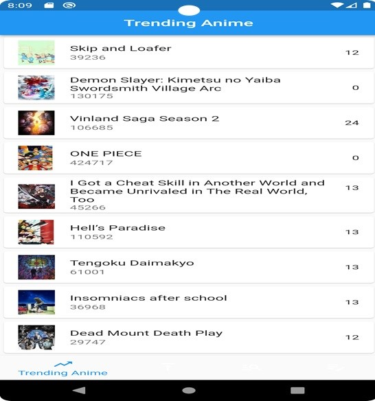
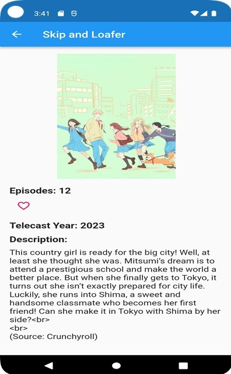
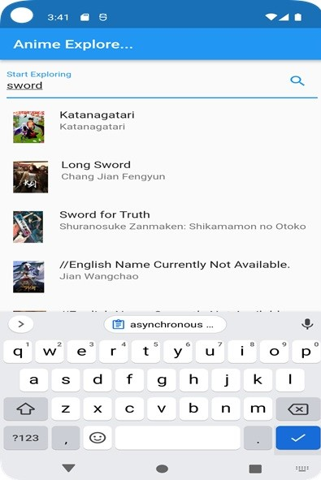
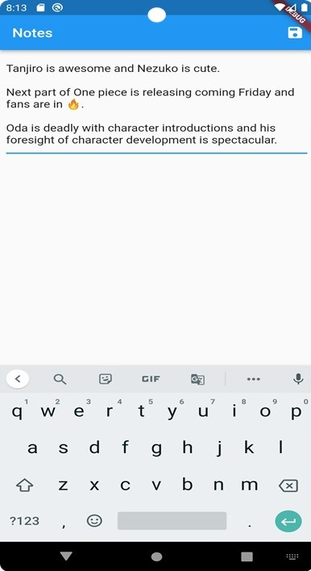

# project

A new Flutter project to search and track anime.

## Getting Started

This is a very basic app which has four main pages, the first page which shows the “Trending Anime”, the second page which shows the “Popular Anime”, the third page which is a “Anime Explore” page and the fourth page which is “Notes” page for saving any Anime related information.

I used Android Studio to create this application and downloaded flutter 3.7.12 version which is the latest version available when I started doing the project. Later as the project evolved, I upgraded this flutter version to 3.10.0 which is the current version when I finished the project. Flutter was downloaded from https://github.com/flutter/flutter.git.

I used “Anilist” API for educational purposes to fetch and display data about the Anime’s using GraphQL as this API supports that type of query fetch. This was both new and informative for me. As this is a flutter app, it runs on both Android and iOS without needing for code changes.

Below is a screenshot showing the Trending anime page.

Below is a screenshot showing the Extended information about the clicked anime.

Below is a screenshot showing the Search anime page.

Below is a screenshot showing the Notes page.

